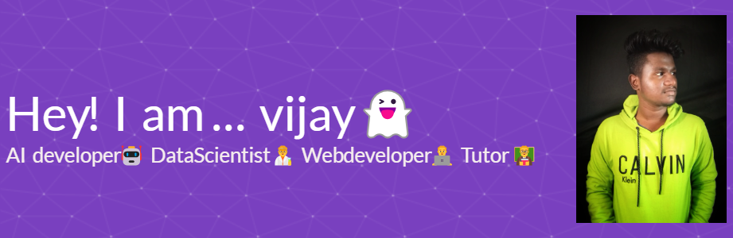

  

<h1 align="center">Vijay Kumar R</h1>

<h3 align="center">AI Engineer | GenAI | LLM | FinTech | FRM</h3>

  
  
  

---

<table>
<tr>
<td width="220" align="center" valign="top">

  

### SKILLS

**AI / GenAI**  
**Machine Learning**  
**NLP / OCR**  
**Programming & Data**  
**Tools & Platforms**  
**Domain Expertise**

</td>

<td valign="top">

## Hi, I'm Vijay Kumar R 👋

I am an **AI Engineer** working in the **Financial Technology** domain, focused on building **production-grade AI systems** for **banking, fraud detection, transaction analytics, document intelligence, compliance automation, and Financial Risk Management**.

I work across **Generative AI, Large Language Models, Retrieval-Augmented Generation, Machine Learning, NLP, OCR, anomaly detection, text-to-SQL systems, and secure on-premise AI deployment**.

---

## Tech Stack

### AI / GenAI
`Large Language Models (LLM · LLMs)` · `Generative AI (GenAI)` · `Retrieval-Augmented Generation (RAG)` · `Prompt Engineering` · `LangChain` · `FAISS` · `Vector Search` · `Embeddings` · `Ollama` · `Local LLMs`

### ML & NLP
`Machine Learning (ML)` · `Deep Learning (DL)` · `Natural Language Processing (NLP)` · `Anomaly Detection` · `Optical Character Recognition (OCR)` · `Computer Vision` · `Speech Processing` · `Audio Feature Extraction (Librosa)`

### Frameworks
`PyTorch` · `TensorFlow` · `Keras` · `Scikit-Learn` · `HuggingFace` · `OpenCV` · `NLTK` · `SpaCy` · `FastAPI`

### Data Engineering
`Python` · `PySpark` · `Apache Kafka` · `Apache Airflow` · `PostgreSQL` · `Pandas` · `NumPy` · `SQL` · `REST APIs`

### Dev & Tools
`Docker` · `Linux` · `Web Scraping` · `Git` · `Metabase` 

### FinTech / Domain
`Real-Time Transaction Monitoring` · `Anti-Money Laundering (AML)` · `Financial Risk Management (FRM)` · `Knowledge Graphs` · `Fraud Detection` · `Customer Analytics` · `Risk Scoring` · `Compliance Automation`

</td>
</tr>
</table>

---

## Projects

### 01. Case Manager AI Assistant
**Tech Stack:** Python · LLMs · RAG Pipeline · Prompt Engineering · Qwen2.5 · Local LLM · Quantization · Conversation Memory · FastAPI · PostgreSQL · Docker · Linux

**Highlights:**  
Built an LLM-powered assistant for **Financial Risk Management** workflows. Enabled investigators to get **overall customer summaries**, **alert raised reasons**, **false positive score with reasoning**, **pattern-based insights**, and **chatbot-style customer/transaction investigation**. Also supported **prompt-based transaction charts and customer profile analysis**.

---

### 02. Real-Time Transaction Anomaly Detection
**Tech Stack:** Python · PySpark · Spark ML · Random Forest · Isolation Forest · Supervised Learning · Unsupervised Learning · Feature Engineering · EDA · Parquet · SQL

**Highlights:**  
Built a real-time anomaly detection pipeline for **50+ crore financial transactions** across multiple channels. Performed **EDA**, **channel-wise analysis**, **feature engineering**, and **Parquet conversion**. Used **Random Forest** and **Isolation Forest** to reduce **false alerts by around 50%**. Deployed for **Indian regional banking environments**.

---

### 03. Intelligent LEA Document Automation
**Tech Stack:** Python · PaddleOCR · NLLB · Qwen2.5-Instruct · IPEX-LLM · Quantization · OCR · NLP · Prompt Engineering · Docker · Linux

**Highlights:**  
Built an intelligent document automation system for **LEA and banking compliance workflows**. Used **PaddleOCR** for extraction, **NLLB** for multilingual translation to English, and **local Qwen2.5-Instruct** with **IPEX-LLM quantization** to extract action items such as **debit freeze**, **account statement requests**, and other **regulatory workflow actions**.

---

### 04. GenAI Text-to-SQL Analytics Dashboard
**Tech Stack:** Python · SQLCoder · Gemini API · Text-to-SQL · Metabase · SQL · REST APIs · Business Intelligence · Data Visualization

**Highlights:**  
Built a **natural language to SQL analytics system** that converts user questions into SQL queries using **SQLCoder** and **Gemini API**. The generated query is sent to **Metabase endpoints** to create **dashboards and charts in seconds**, supporting both **on-premise and cloud AI workflows**.

---

### 05. RAG-Based XML Code Generation Assistant
**Tech Stack:** Python · RAG Pipeline · LLMs · Prompt Engineering · XML Code Generation · Embeddings · Vector Search · FAISS · LangChain · FastAPI · Docker · Linux

**Highlights:**  
Built an internal RAG application that helps operations teams generate **rule engine XML configurations** from natural language prompts. The system retrieves **templates, examples, and internal rule logic patterns** before generating structured XML output, reducing manual effort and improving consistency.

---

### 06. Dynamic Website RAG Chatbot
**Tech Stack:** Next.js · Gemini · Weaviate · RAG Pipeline · Vector Database · Embeddings · Selenium · BeautifulSoup · Web Scraping · Python · Cloud Deployment

**Highlights:**  
Built a **dynamic website RAG chatbot** where users provide a **website URL**, and the system automatically scrapes **visible text content**, stores embeddings in **Weaviate**, and creates a **website-specific chatbot** for question answering. Designed for **dynamic knowledge ingestion** and **cloud deployment**.

---

### 07. NLP Intent Classification System
**Tech Stack:** Python · Bi-Directional LSTM · Deep Learning · NLP · Multi-Class Classification · Data Augmentation · TensorFlow · Keras · Tokenization · Text Preprocessing

**Highlights:**  
Built a **Bi-Directional LSTM** model for **multi-class intent prediction** in conversational ordering workflows. Classified intents such as **food order**, **add to cart**, and **cancel order**. Created a custom dataset using **different combinations and data augmentation techniques** to improve coverage and generalization.

---

## Connect With Me

- **LinkedIn:** [linkedin.com/in/vijaykumar717](https://www.linkedin.com/in/vijaykumar717)
- **GitHub:** [github.com/vijaykumar717](https://github.com/vijaykumar717)
- **Email:** [itsvijaykumar717@gmail.com](mailto:itsvijaykumar717@gmail.com)

---

  <b>Building AI systems for FinTech, FRM, Fraud Detection, Document Intelligence, and Enterprise GenAI.</b>

